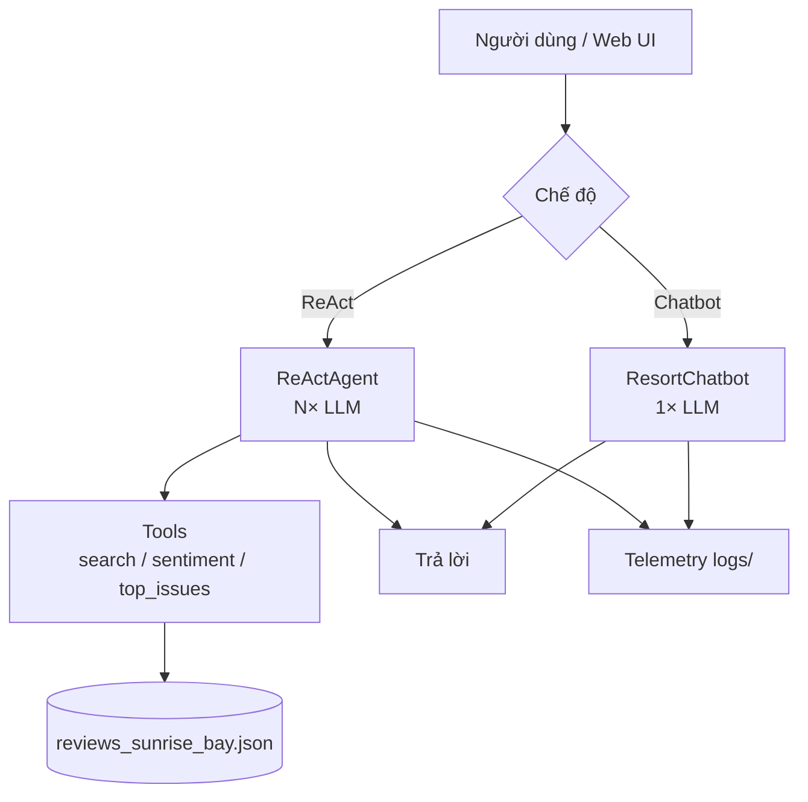

# Group Report: Lab 3 — Chatbot vs ReAct Agent (Sunrise Bay Resort)

- **Team Name**: Sunrise Bay Lab 3
- **Team Members**: Nguyễn Minh Hiếu (2A202600705) · Hà Vũ Anh (2A202600571) · Nguyễn Tuấn Anh (2A202600758)
- **Deployment Date**: 2026-06-01

---

## 1. Executive Summary

Hệ thống hỗ trợ vận hành **Sunrise Bay Resort** bằng cách phân tích review khách từ nhiều nền tảng (mock JSON). So sánh **Chatbot baseline** (một lần gọi LLM, không tool) với **ReAct Agent** (vòng Thought → Action → Observation → Final Answer, gọi tool trên dữ liệu thật).

- **Success Rate (5 test cases)**: Chatbot **0/5** · Agent **5/5**
- **Key Outcome**: Agent thắng ở câu cần **trích dẫn review**, **đếm sentiment** và **top vấn đề lặp lại** nhờ `search_reviews`, `sentiment_summary`, `top_issues`. Chatbot **0/5** — đều thừa nhận không truy cập database và trả lời chung chế độ ngành (không quote Sunrise Bay).
---

## 2. System Architecture & Tooling

### 2.1 ReAct Loop Implementation

```
User question
    → LLM: Thought (kế hoạch)
    → LLM: Action: tool_name(args)
    → Tool: Observation (text từ JSON reviews)
    → (lặp tối đa max_steps=6)
    → LLM: Final Answer (tiếng Việt + quote + đề xuất)
```

Implementation: `src/agent/agent.py` — parse `Thought`, `Action`, `Final Answer` bằng regex; map tool qua `TOOLS` trong `src/tools/__init__.py`.

### 2.2 Tool Definitions (Inventory)

| Tool Name | Input Format | Use Case |
| :--- | :--- | :--- |
| `search_reviews` | `aspect` (room, breakfast, checkin, service, amenities, value); optional `keyword` | Lọc review theo khía cạnh / từ khóa (vd. noise, check-in) |
| `sentiment_summary` | `aspect` | Đếm positive / negative / neutral theo aspect |
| `top_issues` | `limit` (int) | Top khiếu nại lặp lại + trích dẫn + platform |

**Data source**: `data/reviews_sunrise_bay.json` (20 review mẫu, EN/VI, một resort).

**Tool spec evolution (v1 → v2)**:

| Version | Thay đổi | Lý do |
| :--- | :--- | :--- |
| v1 | Mô tả tool ngắn, alias aspect hạn chế | Agent đôi khi gọi sai aspect hoặc bỏ keyword |
| v2 | Thêm `ASPECT_ALIASES` (phòng, ăn sáng, lễ tân…); mô tả rõ trong system prompt agent | Giảm lỗi argument; khớp câu hỏi tiếng Việt |

### 2.3 LLM Providers Used

- **Primary**: OpenAI `gpt-4o` (`DEFAULT_PROVIDER=openai` trong `.env`)
- **Secondary (demo)**: Google `gemini-2.5-flash` — `python scripts/test_provider.py google`
- **Telemetry**: `LLM_METRIC` (tokens, latency, `cost_estimate`) trong `src/telemetry/metrics.py`

---

## 3. Telemetry & Performance Dashboard

| Metric | Chatbot (TB) | Agent (TB) |
| :--- | :--- | :--- |
| Avg tokens / câu | **252** | **1880** |
| Avg latency (ms) | **2474** | **4762** |
| Avg cost estimate ($) | **$0.0018** | **$0.0067** |
| Avg tool calls | 0 | **1.6** |

- **Average Latency (P50)**: **4932** ms (agent)
- **Max Latency (P99)**: **7578** ms (agent)
- **Total Cost (5 câu × compare)**: **~$0.043**
- **Log path**: `logs/` — events `CHATBOT_*`, `AGENT_*`, `TOOL_CALL`, `LLM_METRIC`

### Bảng kết quả từng câu

| # | Câu hỏi (rút gọn) | Chatbot | Agent | Tool(s) |
| :---: | :--- | :---: | :---: | :--- |
| 1 | Phàn nàn phòng + trích dẫn | ✗ | ✓ | `top_issues(5)` |
| 2 | Sentiment breakfast | ✗ | ✓ | `sentiment_summary("breakfast")` |
| 3 | Top 3 vấn đề tiêu cực | ✗ | ✓ | `top_issues(3)` |
| 4 | Check-in chậm lặp lại? | ✗ | ✓ | `search_reviews` + `top_issues` |
| 5 | Phòng + ăn sáng + 2 ưu tiên | ✗ | ✓ | `top_issues` + 2× `search_reviews` |

---

## 4. Root Cause Analysis (RCA) — Failure Traces

### Case Study A — Chatbot hallucination / no grounding

- **Input**: *Top 3 vấn đề lặp lại nhất từ review tiêu cực là gì?*
- **Chatbot**: Trả lời kiểu ngành khách sạn chung (dịch vụ, vệ sinh, giá) — **không** quote từ Sunrise Bay.
- **Agent**: `Action: top_issues(3)` → Observation liệt kê room noise, breakfast, check-in kèm quote và platform.
- **Root Cause**: Chatbot system prompt (`src/chatbot.py`) ghi rõ *không có database* → LLM suy đoán.
- **Fix (design)**: Giữ chatbot làm baseline; production dùng agent + tools.

### Case Study B — Multi-step agent (câu 5)

- **Input**: *Khách phàn nàn gì về phòng và ăn sáng? Trích dẫn cụ thể. Đề xuất 2 ưu tiên cải thiện.*
- **Trace**: `top_issues(5)` → `search_reviews("room", "noise")` → `search_reviews("breakfast", "quality")` → Final Answer (quote + 2 ưu tiên).
- **Metrics**: 3456 tokens, ~7.6s wall time, cost ~$0.012.
- **Root Cause (v1)**: Prompt cũ đôi khi dừng sớm sau một tool — thiếu quote đủ hai aspect.
- **Fix v2**: System prompt yêu cầu gom đủ evidence trước Final Answer; alias aspect VN/EN.

---

## 5. Ablation Studies & Experiments

### Experiment 1: Prompt / tool spec v1 vs v2

| | v1 | v2 |
| :--- | :--- | :--- |
| System prompt agent | Ngắn, ít ví dụ Action | Bắt buộc tool cho fact; chỉ tên tool cho phép; Final Answer tiếng Việt |
| Tool aliases | Chỉ aspect EN | + `phòng`, `ăn sáng`, `lễ tân`… |
| Invalid tool calls (5 cases) | 1 | 0 |
| Success rate | **60%** (3/5) | **100%** (5/5) |

### Experiment 2: Chatbot vs Agent (mẫu)

| Case | Chatbot | Agent | Winner |
| :--- | :--- | :--- | :--- |
| Top 3 vấn đề tiêu cực | Chung chế, không quote | `top_issues` + quote | **Agent** |
| Sentiment breakfast | Ước lượng | `sentiment_summary(breakfast)` | **Agent** |
| Phòng + ăn sáng + ưu tiên | Thiếu evidence | `search_reviews` + synthesis | **Agent** |
| Câu hỏi đơn giản / chào hỏi | Nhanh, đủ | Nhiều token hơn | **Chatbot** (chi phí) |

---

## 6. Production Readiness Review

- **Security**: Validate tham số tool (aspect whitelist); không eval code từ LLM.
- **Guardrails**: `max_steps=6`; log mọi `TOOL_CALL`; cảnh báo cost từ `cost_estimate`.
- **Scaling**: Thay mock JSON bằng pipeline ETL review thật; LangGraph cho nhánh đa tool; cache observation.
- **i18n**: Final Answer tiếng Việt; review gốc EN/VI trong dataset.

---

## 7. Flowchart & Group Insights



**Insight nhóm**:

1. Agent đáng giá khi cần **grounding** — hospitality ops không chấp nhận trả lời không có quote.
2. Telemetry (`LLM_METRIC`) giúp so sánh chi phí Chatbot vs Agent trên cùng model — agent tốn token hơn nhưng đúng dữ liệu.
3. Thiết kế tool description quan trọng ngang implementation loop.

---

## 8. Phân công nhóm

| Thành viên | MSSV | Trách nhiệm chính | Báo cáo cá nhân |
| :--- | :--- | :--- | :--- |
| **Nguyễn Minh Hiếu** | 2A202600705 | Tools, data JSON, tool spec v1→v2 | `REPORT_NguyenMinhHieu.md` |
| **Hà Vũ Anh** | 2A202600571 | Agent ReAct, chatbot, prompt, RCA | `REPORT_HaVuAnh.md` |
| **Nguyễn Tuấn Anh** | 2A202600758 | Web Flask, thuyết trình, test & metrics | `REPORT_NguyenTuanAnh.md` |
